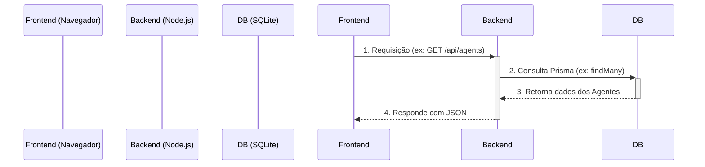
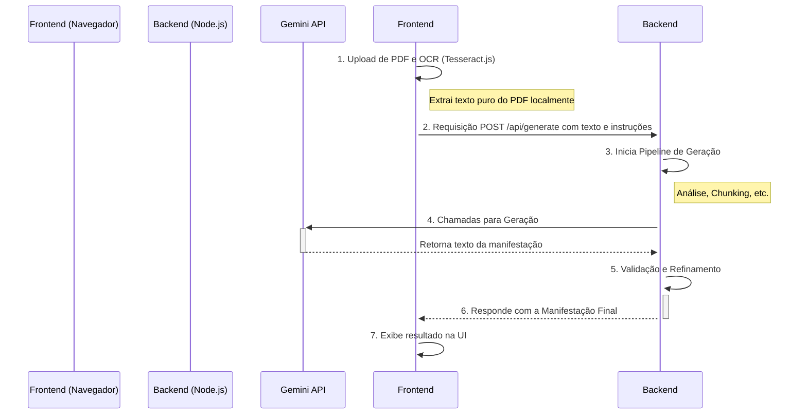

# 1. Arquitetura Atual: Cliente-Servidor

Este documento detalha a arquitetura da aplicação, que foi evoluída de um modelo 100% client-side para uma arquitetura cliente-servidor.

## 1.1. Visão Geral

A aplicação opera como uma SPA (Single Page Application) que se comunica com um backend dedicado Node.js. Esta abordagem permite maior escalabilidade, persistência de dados robusta e abre caminho para funcionalidades futuras como autenticação de usuários.

-   **Privacidade:** O processamento de documentos (OCR) continua a ser executado no lado do cliente, garantindo que o conteúdo sensível dos processos nunca saia do navegador do usuário antes de ser enviado para a API do Google Gemini.
-   **Persistência Robusta:** Os dados dos Agentes de IA são agora gerenciados por um servidor e armazenados em um banco de dados SQLite, garantindo que não sejam perdidos ao limpar o cache do navegador.
-   **Escalabilidade:** A arquitetura de servidor permite futuras expansões, como gerenciamento de contas de usuário, histórico de gerações e colaboração.

---

## 1.2. Diagramas de Fluxo

### Fluxo de Gerenciamento de Agentes

### Fluxo de Geração de Manifestação

---

## 1.3. Componentes da Arquitetura

### 1.3.1. Processamento de Documentos (Client-Side OCR)

-   **Tecnologias:** `PDF.js` e `Tesseract.js`.
-   **Fluxo:** A extração de texto do PDF (incluindo OCR) é executada inteiramente no navegador para maximizar a privacidade. O texto bruto é então enviado ao backend para processamento.

### 1.3.2. Backend e Orquestração da IA (Node.js + Express)

-   **Tecnologia:** Servidor Node.js com Express, Prisma ORM e o SDK `@google/genai`.
-   **Responsabilidade:** O backend é o cérebro da aplicação. Ele recebe o texto e as instruções do frontend e orquestra todo o pipeline de geração:
    -   **Análise Inicial:** Identifica o tipo de documento.
    -   **Chunking:** Divide documentos longos de forma inteligente.
    -   **Geração:** Constrói os prompts e chama a API do Gemini.
    -   **Validação:** Verifica a qualidade da resposta.
    -   **Persistência:** Salva os agentes de IA, logs de auditoria e sessões de geração no banco de dados SQLite.
-   **Fluxo:** O frontend faz uma única chamada para a API do backend (`POST /api/generate`), e o backend lida com toda a complexidade da interação com a IA.