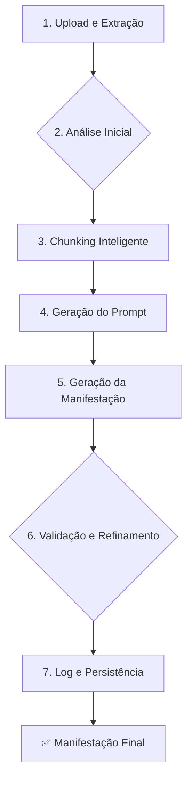

# 3. Deep Dive: O Pipeline de Geração

O coração do Assistente Jurídico IA é o seu pipeline de geração de manifestações. Este processo de várias etapas foi projetado para transformar um documento PDF bruto em uma petição bem-estruturada e estilizada.

A seguir, um detalhamento do fluxo de trabalho **atualmente implementado**.

## 3.1. Visão Geral do Pipeline

O pipeline pode ser visualizado como uma sequência de estágios, onde cada um adiciona uma camada de processamento e inteligência ao documento.

## 3.2. Detalhamento das Etapas

### 1. Upload e Extração (Client-Side)
- **O que acontece:** O usuário faz o upload de um arquivo PDF. O texto é extraído inteiramente no navegador (`client-side`) usando as bibliotecas `PDF.js` e `Tesseract.js` (para OCR).
- **Foco:** Privacidade. O conteúdo sensível do documento não sai da máquina do usuário nesta fase.

### 2. Análise Inicial (Backend)
- **O que acontece:** O texto extraído é enviado para o backend, onde a função `analyzeDocument` realiza uma análise preliminar.
- **Técnica:** Usa expressões regulares (regex) para extrair entidades básicas como partes (`requerente`), valores (`R$`) e datas.
- **Classificação:** Um sistema de pontuação (`score-based`) analisa a ocorrência de palavras-chave ("habilitação", "crédito", "manifestação") para determinar o tipo de documento.

### 3. Chunking Inteligente (Backend)
- **O que acontece:** Documentos longos são divididos em "chunks" (pedaços) menores para caber no contexto da IA.
- **Serviço:** `documentChunker.ts`.
- **Inteligência:**
    - **Estratégias Adaptativas:** As regras de divisão (tamanho do chunk, etc.) mudam de acordo com o tipo de documento identificado na etapa anterior.
    - **Priorização:** Os chunks são pontuados por relevância, e os mais críticos são processados primeiro.

### 4. Geração do Prompt (Backend)
- **O que acontece:** O sistema constrói o prompt final que será enviado para a IA.
- **Componentes do Prompt:**
    - **Instrução do Agente:** A `systemInstruction` do Agente Treinável do usuário (focada em estilo e formatação).
    - **Resumo Contextual:** Um resumo não gerado por IA, mas sim uma concatenação de metadados e entidades extraídas para dar contexto global à IA.
    - **Instruções do Usuário:** As instruções específicas fornecidas na interface.
    - **Conteúdo:** O texto do documento (ou um chunk dele).

### 5. Geração da Manifestação (Backend)
- **O que acontece:** O prompt é enviado para a API do Google Gemini.
- **Otimização:** Se houver múltiplos chunks, eles são processados em **paralelo** (`Promise.all`) para acelerar significativamente o tempo de resposta. A IA gera uma parte da manifestação para cada chunk, que são depois combinadas.

### 6. Validação e Refinamento (Backend)
- **O que acontece:** A manifestação gerada passa por um crivo de qualidade.
- **Serviço:** `qualityValidator.ts`.
- **Fluxo:**
    1.  A qualidade do texto é avaliada e recebe uma pontuação (de 0 a 10).
    2.  Se a pontuação for muito baixa (atualmente `< 5`), o sistema executa **um único passe de refinamento**.
    3.  Um novo prompt é gerado, incluindo os problemas identificados, e a IA é instruída a corrigir o texto.
- **Limitação Atual:** O refinamento não é um loop iterativo; ele ocorre no máximo uma vez.

### 7. Log e Persistência (Backend)
- **O que acontece:** Todo o ciclo de vida da geração é registrado.
- **Serviços:** `auditLogger.ts` e `sessionService.ts`.
- **Dados Salvos:**
    - **Auditoria:** Cada etapa (com tempos, metadados, tokens usados) é registrada para fins de compliance e depuração.
    - **Sessão:** O resultado final, junto com os dados intermediários, é salvo no banco de dados. Isso permite que um usuário possa, no futuro, refinar ou consultar uma geração anterior.