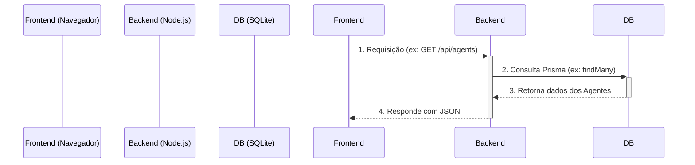
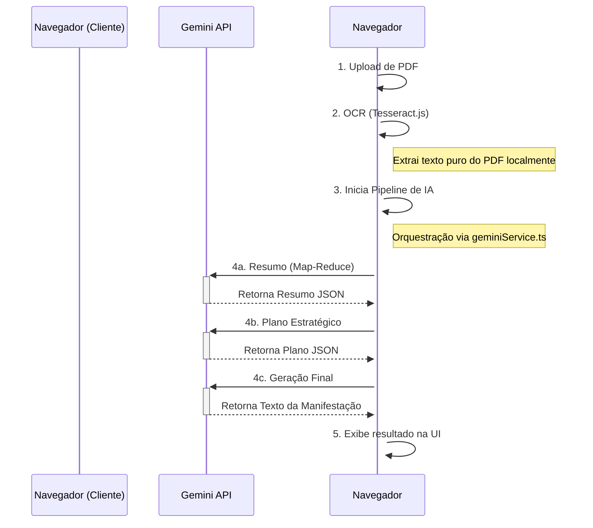

# Arquitetura da Aplicação (Cliente-Servidor)

Este documento detalha a arquitetura da aplicação, que foi evoluída de um modelo 100% client-side para uma arquitetura cliente-servidor.

## 1. Visão Geral

A aplicação opera como uma SPA (Single Page Application) que se comunica com um backend dedicado Node.js. Esta abordagem permite maior escalabilidade, persistência de dados robusta e abre caminho para funcionalidades futuras como autenticação de usuários.

-   **Privacidade:** O processamento de documentos (OCR) continua a ser executado no lado do cliente, garantindo que o conteúdo sensível dos processos nunca saia do navegador do usuário antes de ser enviado para a API do Google Gemini.
-   **Persistência Robusta:** Os dados dos Agentes de IA são agora gerenciados por um servidor e armazenados em um banco de dados SQLite, garantindo que não sejam perdidos ao limpar o cache do navegador.
-   **Escalabilidade:** A arquitetura de servidor permite futuras expansões, como gerenciamento de contas de usuário, histórico de gerações e colaboração.

---

## 2. Diagramas de Fluxo

### Fluxo de Gerenciamento de Agentes

### Fluxo de Geração de Manifestação

---

## 3. Componentes da Arquitetura

### 3.1. Processamento de Documentos (Client-Side OCR)

-   **Tecnologias:** `PDF.js` e `Tesseract.js`.
-   **Fluxo:** Permanece o mesmo. O OCR é executado inteiramente no navegador para maximizar a privacidade do conteúdo do processo.

### 3.2. Backend e Persistência de Dados (Node.js + SQLite)

-   **Tecnologia:** Servidor Node.js com Express, Prisma ORM e banco de dados SQLite.
-   **Uso:** Um backend dedicado gerencia os Agentes de IA, persistindo-os em um banco de dados SQLite. Isso centraliza os dados e permite futuras expansões, como autenticação de usuários e sincronização entre dispositivos.
-   **Fluxo:** O `agentDataService` no frontend foi refatorado para fazer chamadas HTTP (`fetch`) para a API RESTful do backend (ex: `GET /api/agents`). O backend, por sua vez, usa o Prisma para executar operações CRUD no banco de dados.

### 3.3. Orquestração da IA (Gemini Service)

-   **Tecnologia:** SDK `@google/genai`.
-   **Responsabilidade:** O `geminiService` continua sendo o cérebro da aplicação, orquestrando o pipeline multi-etapas de chamadas para a API Gemini diretamente do cliente.
